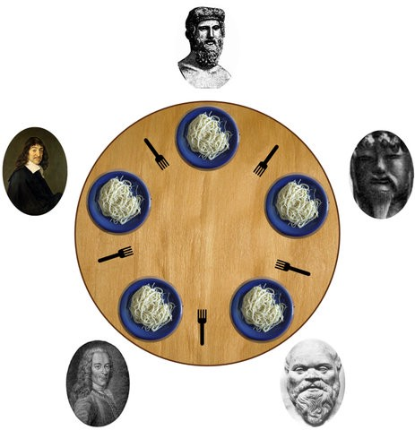
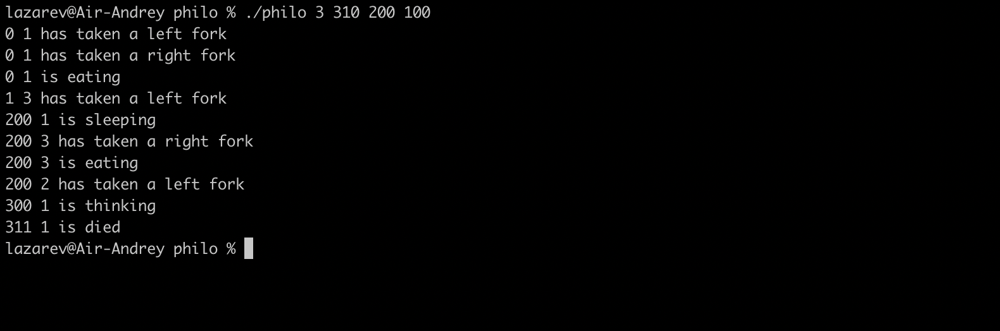

# Проект "Philosophers"
[](https://svgshare.com/i/ZjP.svg)

[](https://github.com)
[](https://shields.io/)

### Описание проекта
Всем привет :v:

Цель этого проекта - изучение и применение на практике многопоточного программирования, а также правильного использования общих данных между потоками.
В качестве примера выступает решение [задачи об обедающих философах.](https://en.wikipedia.org/wiki/Dining_philosophers_problem)
Это классический случай разделения ресурсов в программировании - ключевой проблемой является образование [дедлока (взаимной блокировки)](https://en.wikipedia.org/wiki/Deadlock) и невозможности дальнейшего выполнения программы.
В данном проекте эта проблема решается с помощью использования [мьютексов.](https://en.wikipedia.org/wiki/Lock_(computer_science))

### Постановка задачи
Несколько философов сидят вокруг круглого стола, перед каждым из них стоит тарелка спагетти. Вилки лежат на столе между каждой парой ближайших философов.
Каждый философ может либо есть, либо размышлять, либо спать. Приём пищи не ограничен количеством оставшихся спагетти — подразумевается бесконечный запас.
Тем не менее, философ может есть только тогда, когда держит две вилки — взятую справа и слева.

Каждый философ может взять ближайшую вилку (если она доступна) или положить — если он уже держит её. Взятие каждой вилки и возвращение её на стол являются раздельными действиями, которые должны выполняться одно за другим.
Цель задачи заключается в том, чтобы разработать модель поведения (параллельный алгоритм), при котором каждый из философов будет чередовать приём пищи, сон и размышления.



### Использование
Запуск:
```bash
git clone https://github.com/Dronoti/philosophers.git philosophers && cd philosophers && make && make clean && ./philo 3 310 200 100
```
Программа принимает на вход 4 обязательных и 1 необязательный параметр:
* количество философов
* время, которое каждый из философов может прожить без приема пищи (в миллисекундах)
* время, которое тратит каждый из философов на прием пищи (в миллисекундах)
* время, которое необходимо каждому из философов на сон (в миллисекундах)
* количество раз, сколько каждый из философов должен поесть для завершения программы (необязательный параметр)

Программа завершается если хотя бы один из философов умрет или каждый из них поест заданное количество раз.

### Демонстрация


### Дополнительно
Подробная функциональность программы, ограничения и требования к ее реализации описаны в [задании.](./philosophers.pdf)